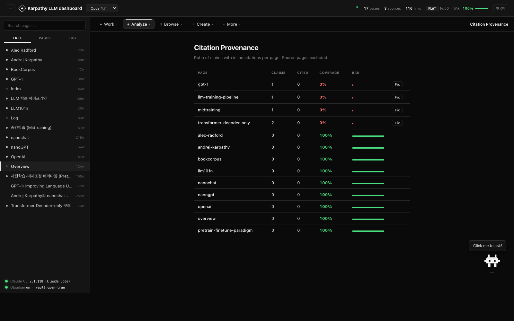
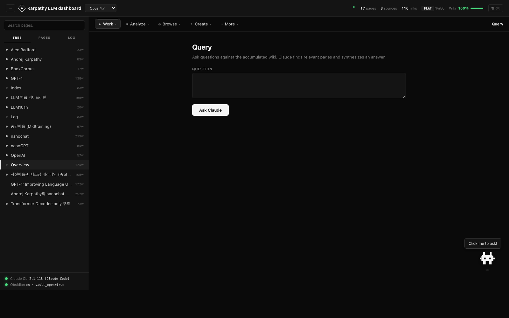

<div align="center">

<br />


<h1>Memex</h1>

<p><strong>스스로 쓰이는 개인 지식 베이스.</strong></p>

<p>
소스를 드롭하면 Claude가 기록·정리·연결을 대신합니다.<br/>
지식은 쌓이기만 합니다.
</p>

<p>
<a href="#빠른-시작"></a>
&nbsp;

&nbsp;

&nbsp;

&nbsp;
<a href="README.md"></a>
</p>

<br />

<p>
<em>"Obsidian이 IDE, Claude가 프로그래머, 위키가 코드베이스."</em>
</p>

<br />


</div>

---

## 왜?

LLM으로 문서를 다루는 대부분의 방식은 **질문할 때마다 지식을 처음부터 재발견**합니다. RAG가 조각을 찾고, 모델이 답을 엮고, 끝나면 아무것도 남지 않아요. 같은 문서에 10번 질문하면 → 10번 재발견.

**Memex는 이걸 뒤집습니다.** 소스는 한 번만 넣으면 됩니다. Claude가 읽고, 영속 위키에 통합하고, 기존 페이지와의 모순을 표시하고, 인용을 연결하고, 커밋합니다. 10번째 질문 즈음이면 위키가 이미 종합을 마친 상태입니다 — 정리의 부담이 사라지니까요.

[Andrej Karpathy의 LLM Wiki 패턴](https://gist.github.com/karpathy/442a6bf555914893e9891c11519de94f) 기반. [Vannevar Bush가 1945년에 구상한 Memex](https://en.wikipedia.org/wiki/Memex)에서 이름을 가져왔습니다.

---

## 패턴

```
   raw/              원본 소스. 불변. 4단계 보호.
     │
     ▼  ingest
   wiki/             Claude가 관리하는 페이지. 엔티티·개념·요약.
     │               인라인 인용 [^src-*]. 자동 교차참조.
     │               모든 변경은 git 커밋.
     ▼
   Obsidian 그래프 + 대시보드
                     탐색·질문·분석·성찰·비교·작성.
```

- **사람**: 소스 큐레이션, 질문, 분석 방향 결정.
- **Claude**: 요약, 교차참조, 인용, 모순 탐지, 파일 정리.
- **위키**: 쌓입니다.

---

## 빠른 시작

```bash
git clone https://github.com/cmblir/memex.git
cd memex
python dashboard/server.py    # Python 3.10+, pip 의존성 0
```

`http://localhost:8090` 열기. 끝.

<br />

<details>
<summary><strong>요구사항</strong></summary>

- Python 3.10+ (stdlib만 사용)
- [Claude Code CLI](https://docs.anthropic.com/en/docs/claude-code) — `npm install -g @anthropic-ai/claude-code`
- 브라우저
- Obsidian — *선택사항*이지만 이 레포는 Obsidian vault로 바로 쓸 수 있게 구성되어 있음.

</details>

---

## 제공 기능

<table>
<tr>
<td width="50%" valign="top">

### ◆ 핵심 작업
- **Ingest** — 소스 붙여넣기 → diff + WHY 리포트 + 자동 커밋
- **Query** — 위키에 질문. 읽은 파일·Wiki Ratio·토큰 추적
- **Lint** — 16개 항목 건강 검진 + 자동 수정
- **Reflect** — 위키 전체에 대한 주간 메타 분석
- **Write** — 위키 기반 에세이 초안 (인용 자동 삽입)
- **Compare** — 두 페이지 → 공통점·차이점
- **Review** — 오래된 페이지 복습
- **Search** — TF-IDF 전문 검색 (의존성 0)
- **Slides** — 임의 페이지를 Marp 슬라이드로
- **Graph** — Force-directed 지식 그래프

</td>
<td width="50%" valign="top">

### ◆ 인프라
- **Git 기반 이력** — 모든 수집은 커밋
- **원클릭 되돌리기** — 특정 수집만 취소
- **인라인 인용** — `[^src-*]` 숫자 배지로 렌더
- **raw/ 불변성** — 4단계 보호
- **적응형 인덱싱** — flat → hierarchical → indexed (자동)
- **스키마 (CLAUDE.md)** — Claude의 규칙
- **WHY 리포트** — 모든 수집이 자기 판단 근거 설명
- **쿼리 로그** — Wiki Ratio 게이지 근거
- **이중 언어 UI** — EN / 한국어 토글
- **모델 선택** — Opus / Sonnet / Haiku

</td>
</tr>
</table>

---

## 대시보드

<div align="center">
<em>흑백. 카테고리. 인터랙티브.</em>
</div>

<br />

- **흑백** — 색은 상태·diff에만 사용.
- **카테고리형 툴바** — 13개 작업이 5개 드롭다운에 (작업·분석·탐색·만들기·더보기).
- **리사이즈 사이드바** — 경계 드래그 또는 `Cmd/Ctrl + B`로 접기.
- **폴더 연속 뷰** — 폴더 *이름* 클릭 → 하위 페이지 한 화면에 스크롤.
- **실시간 상태** — Claude CLI + Obsidian 감지, raw fact만.
- **Wiki Ratio 게이지** — Claude가 wiki vs raw를 얼마나 참고했는지. 0.4 미만이면 위키가 raw를 대체하지 못한다는 신호.
- **떠다니는 Claude 캐릭터** — 클릭하면 대시보드 기능에 대해 물어볼 수 있는 챗봇. 위키 내용 질문은 Query로 리다이렉트.

### 화면들

<table>
<tr>
<td width="50%"></td>
<td width="50%"></td>
</tr>
<tr>
<td align="center"><sub><strong>Overview</strong> — 위키 통계, 커버리지, 시작 가이드</sub></td>
<td align="center"><sub><strong>Graph</strong> — Force-directed 지식 그래프</sub></td>
</tr>
<tr>
<td width="50%"></td>
<td width="50%"></td>
</tr>
<tr>
<td align="center"><sub><strong>Ingest</strong> — 소스 붙여넣기, Claude가 페이지 생성</sub></td>
<td align="center"><sub><strong>History</strong> — git 기반 수집 이력 + 되돌리기</sub></td>
</tr>
<tr>
<td width="50%"></td>
<td width="50%"></td>
</tr>
<tr>
<td align="center"><sub><strong>Provenance</strong> — 페이지별 인용 커버리지</sub></td>
<td align="center"><sub><strong>Query</strong> — 위키에 질문, 읽은 파일 추적</sub></td>
</tr>
</table>

<sub><em>직접 스크린샷을 찍으려면 서버가 실행 중일 때 <code>docs/capture.sh</code> 실행.</em></sub>

---

## 지식이 쌓이는 방식

```
소스 드롭 ─────────►  raw/article.md
                      │
                      ▼
  Claude가 읽고 쓰기:
  ├─ wiki/source-article.md     (소스 요약)
  ├─ wiki/entity-X.md           (신규 또는 갱신)
  ├─ wiki/concept-Y.md          (신규 또는 갱신 + 인용)
  ├─ wiki/index.md              (갱신)
  ├─ wiki/log.md                (append)
  └─ ingest-reports/...md       (WHY 리포트)

                      │
                      ▼
  git commit "ingest: <title>"
                      │
                      ▼
  대시보드: diff + 판단 근거 + 승인/되돌리기
```

모든 수집은 되돌릴 수 있고, 모든 주장에는 인용이 붙고, 모든 모순에는 3가지 정책(Historical / Disputed / Superseded) 중 하나가 적용됩니다.

---

## CLI 사용

대시보드의 모든 기능은 터미널에서도 작동합니다:

```bash
claude
"Ingest raw/some-article.md"
"Self-Attention이 뭐야?"
"Lint the wiki"
"Reflect on the last 10 ingests"
```

대시보드는 내부적으로 `claude -p`를 호출합니다. 양쪽은 같은 상태를 공유.

---

## 설정

```bash
# 환경 변수
CLAUDE_TIMEOUT=1200  python dashboard/server.py   # 큰 수집용 20분 timeout
CLAUDE_QUICK_TIMEOUT=30
CLAUDE_TOOLS=Edit,Write,Read,Glob,Grep
```

또는 `CLAUDE.md`를 편집하세요 — Claude가 따르는 스키마입니다. Frontmatter 규칙·인용 규칙·모순 해결·수집 워크플로·lint 체크리스트. 다음 작업부터 반영됩니다.

---

## 트러블슈팅

<details>
<summary><strong>"Claude CLI timeout"</strong></summary>

기본 10분. `CLAUDE_TIMEOUT=1800`으로 더 늘릴 수 있습니다. timeout 발생 시 대시보드에 **Claude CLI 진단 실행** 버튼이 나타나고, `/api/claude/diagnose`로 설치·인증·응답시간·모델 속도를 확인합니다.

</details>

<details>
<summary><strong>"vault not registered"</strong></summary>

상태 바에 호버하면 프로젝트 경로 vs Obsidian이 아는 vault가 표시됩니다. **Register** 버튼으로 `obsidian.json`에 자동 등록 후 Obsidian 재시작.

</details>

<details>
<summary><strong>수집이 느림</strong></summary>

Opus 4.7이 가장 느립니다. 헤더 드롭다운에서 **Sonnet 4.6**이나 **Haiku 4.5**로 전환하면 훨씬 빨라집니다.

</details>

<details>
<summary><strong>Expecting value: line 1 column 1</strong></summary>

Python의 빈 JSON 에러입니다. 이미 수정됨 — 모든 엔드포인트가 크래시 시에도 유효한 JSON을 반환. 그래도 보이면 `/tmp/wiki-server.log`에서 traceback을 확인하세요.

</details>

---

## 레포 구조

```
raw/                       불변 소스
wiki/                      Claude가 관리하는 페이지
  index.md                 카탈로그 (flat/hierarchical 자동)
  log.md                   활동 타임라인
  overview.md              통계 + 커버리지
ingest-reports/            수집당 WHY 리포트 1개
reflect-reports/           주간 메타 분석
dashboard/
  server.py                의존성 0 API 서버
  index.html               단일 파일 대시보드 UI
  provenance.py            인용 파싱 + 커버리지
  index_strategy.py        적응형 인덱싱
  claude_character.svg     떠다니는 도우미
CLAUDE.md                  스키마 (Claude의 규칙)
.obsidian/                 미리 구성된 vault
```

---

## API

대시보드는 30개 이상의 엔드포인트로 서버와 통신합니다:

<details>
<summary><strong>전체 엔드포인트 보기</strong></summary>

| Method | Path | 설명 |
|--------|------|------|
| GET | `/api/status` | Claude CLI + Obsidian — raw facts |
| GET | `/api/wiki` | 전체 위키 데이터 |
| GET | `/api/folders` | 폴더 트리 |
| GET | `/api/hash` | 변경 감지 |
| GET | `/api/schema` | CLAUDE.md 읽기 |
| GET | `/api/history` | 수집 커밋 이력 |
| GET | `/api/provenance` | 인용 커버리지 |
| GET | `/api/query-stats` | Wiki Ratio |
| GET | `/api/index/status` | 인덱스 전략 배지 |
| GET | `/api/raw/integrity` | raw/ 변조 체크 |
| GET | `/api/reflect/status` | 마지막 성찰 날짜 |
| GET | `/api/review/list` | 오래된 페이지 |
| GET | `/api/settings` | 모델 선택 데이터 |
| GET | `/api/claude/diagnose` | CLI 빠른 진단 |
| POST | `/api/ingest` | 새 소스 → 위키 페이지 |
| POST | `/api/query` | 위키에 질문 |
| POST | `/api/query/save` | 답변을 페이지로 저장 |
| POST | `/api/lint` / `/api/lint/fix` | 건강 검진 |
| POST | `/api/reflect` | 메타 분석 |
| POST | `/api/write` | 작성 동반자 |
| POST | `/api/compare` | 두 페이지 분석 |
| POST | `/api/review/refresh` | 오래된 페이지 갱신 |
| POST | `/api/slides` | Marp 내보내기 |
| POST | `/api/search` | TF-IDF 검색 |
| POST | `/api/suggest/sources` | 다음 수집할 소스 |
| POST | `/api/assistant` | 대시보드 도우미 챗봇 |
| POST | `/api/provenance/fix` | 인용 보완 |
| POST | `/api/index/rebuild` | 인덱스 강제 재빌드 |
| POST | `/api/revert` | 수집 되돌리기 |
| POST | `/api/page` / `/update` / `/delete` | 페이지 CRUD |
| POST | `/api/folder` | 폴더 생성 |
| POST | `/api/schema` | CLAUDE.md 수정 |
| POST | `/api/settings` | Claude 모델 변경 |
| POST | `/api/obsidian/register` | 이 폴더를 obsidian.json에 추가 |

</details>

---

## 단축키

- `Cmd/Ctrl + B` — 사이드바 접기/펼치기
- `Esc` — 드롭다운 / 모달 닫기

---

## 크레딧

- **패턴**: [Andrej Karpathy](https://github.com/karpathy) — *[LLM Wiki](https://gist.github.com/karpathy/442a6bf555914893e9891c11519de94f)*.
- **조상**: [Vannevar Bush, "As We May Think"](https://en.wikipedia.org/wiki/As_We_May_Think), 1945.
- **제작 도구**: [Claude Code](https://docs.anthropic.com/en/docs/claude-code).

---

<div align="center">
<br/>
<sub>MIT License · <a href="README.md">English README</a></sub>
</div>
